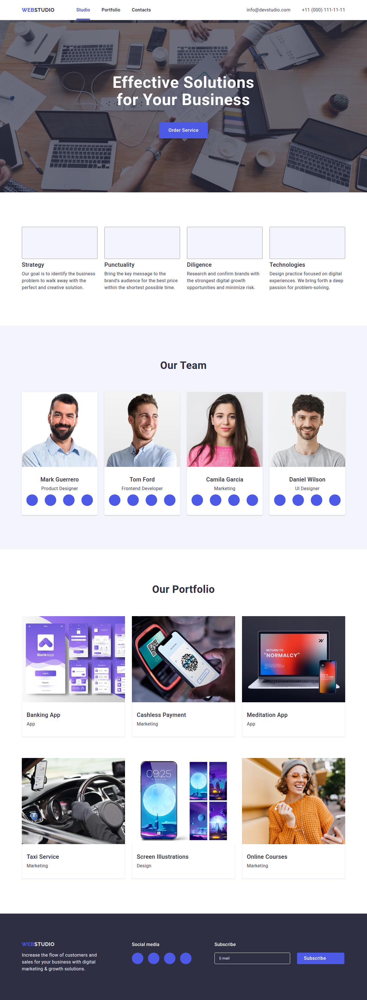
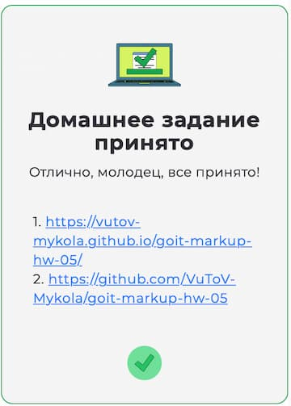

<!-- AUTOGEN:STATS -->
      

## 📸 Скріншот проекту

<!-- END:AUTOGEN -->

## Мої досягнення

 

## Мої сертифікати - Пройшов курс на Sololearn :

[SOLOLEARN](https://www.sololearn.com/certificates/CT-UJ9JRYCU)

## 📌 Завдання
• Створи репозиторій goit-markup-hw-06.
• Склонуй створений репозиторій і скопіюй в нього файли попередньої роботи.
• Виконай верстку адаптивної версії всіх елементів сторінки домашнього завдання #6.
• Налаштуй GitHub Pages і додай посилання на живу сторінку в секцію About GitHub-репозиторія.

Проєкт

«A1» При перегляді сторінки на будь-якому пристрої шириною від 320px, не з'являється горизонтальна смуга прокручування.

«A2» Вихідний код відформатований за допомогою Prettier.

«A3» Всі зображення та текстовий контент взяті з макета.

«A4» Підключений нормалізатор стилів modern-normalize

«A5» Код написаний з дотриманням настанови.

Респонсивність

«B1» У всіх сторінок в блоці <head> є метатег viewport.

«B2» Верстка виконана щодо трьох точок перелому: 320px, 768px і 1158px.

«B3» Всі фонові і контентні растрові зображення — респонсивні і підтримують екрани щільністю x1 и x2.

«B4» Для респонсивних фонових зображень використані медіа-функція min-resolution.

«B5» При написанні стилів використаний Mobile First підхід і медіа-функція min-width.

«B6» Стилі, необхідні тільки у певному проміжку, закриті в медіа-запити (min-width: ) and (max-width: ) або тільки (max-width: ).

«B7» В медіа-запитах відсутнє зайве дублювання стилів.

Мобільне меню

«C1» Виконана розмітка всіх елементів мобільного меню.

«C2» Виконано оформлення всіх елементів мобільного меню.

«C3» Ширина меню відповідає макету.

«C4» За висотою меню займає весь в'юпорт.

«C5» Спочатку меню приховано.

«C6» Якщо додати на елемент меню клас is-open, воно з'являється.
